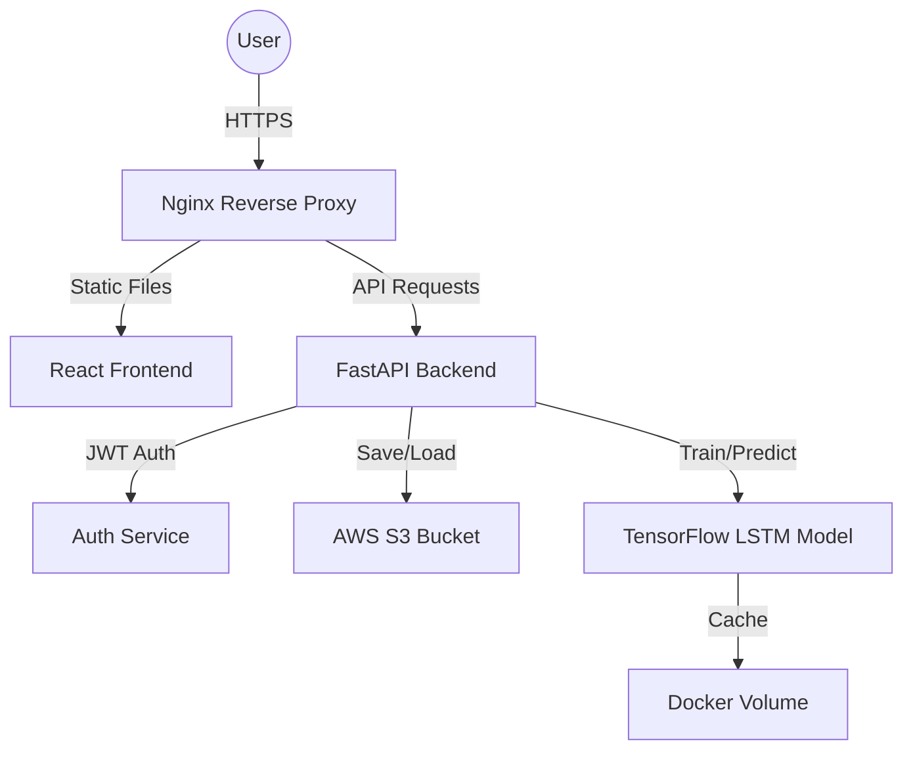

# 📈 StockPredict AI

A high-performance, full-stack stock market prediction platform. Leverage **LSTM (Long Short-Term Memory)** neural networks to forecast stock prices with confidence, backed by a robust **FastAPI** backend and a modern **React** frontend.

---

## ✨ Features

- **Deep Learning Predictions**: Multi-layer LSTM model for high-accuracy time-series forecasting.
- **Interactive Dashboard**: Visualize historical data and future predictions with dynamic charts.
- **AWS S3 Integration**: Secure, scalable storage for all your stock datasets.
- **Production-Ready**: Fully containerized with Docker, Nginx reverse proxy, and JWT security.
- **Automated Training**: On-the-fly model training with early stopping and learning rate optimization.

---

## 🏗️ Architecture



---

## 🚀 Quick Start (Local Development)

### 📋 Prerequisites
- **Python**: 3.11 or higher
- **Node.js**: 20.x or higher
- **AWS Account**: S3 bucket and IAM credentials (or use local mock mode)

### 1. Repository Setup
```bash
git clone https://github.com/your-username/stock-market-app.git
cd stock-market-app
cp .env.example .env
# Open .env and fill in your AWS credentials
```

### 2. Backend Initialization
```bash
cd backend
python -m venv venv
source venv/bin/activate  # Windows: venv\Scripts\activate
pip install -r requirements.txt
python -m uvicorn app.main:app --reload --port 8000
```
- **API Docs**: [http://localhost:8000/docs](http://localhost:8000/docs)

### 3. Frontend Initialization
```bash
cd ../frontend
npm install
npm start
```
- **Dashboard**: [http://localhost:3000](http://localhost:3000)

### 4. Seed Data
```bash
# In the root directory
python generate_sample_csv.py
# This creates 'sample_stock_data.csv' for testing
```

---

## 🐳 Docker Deployment (Recommended)

The easiest way to run the full stack in production-like conditions.

### 🛠️ One-Command Build & Run
```bash
# Ensure .env is configured in the root
docker-compose up --build -d
```

- **Frontend**: [http://localhost](http://localhost) (Port 80)
- **Backend API**: [http://localhost:8000](http://localhost:8000)
- **Health Check**: `curl http://localhost/health`

---

## ☁️ AWS EC2 Deployment Guide

### 1. Provision EC2 Instance
- **AMI**: Amazon Linux 2023 or Ubuntu 22.04 LTS.
- **Instance Type**: `t3.medium` or any available high free tier instance(Minimum 4GB RAM required for model training).
- **Security Group**:
  - Inbound: SSH (22), HTTP (80), HTTPS (443), Backend (8000).

### 2. Prepare Environment
```bash
sudo yum update -y
sudo yum install -y docker git
sudo systemctl enable --now docker
sudo usermod -a -G docker ec2-user

# Install Docker Compose
sudo curl -L "https://github.com/docker/compose/releases/latest/download/docker-compose-$(uname -s)-$(uname -m)" -o /usr/local/bin/docker-compose
sudo chmod +x /usr/local/bin/docker-compose
```

### 3. Deploy Application
```bash
git clone <your-repo-url>
cd stock-market-app
cp .env.example .env && nano .env  # Update with production values
docker-compose up -d --build
```

### 4. S3 Bucket Configuration
Ensure your S3 bucket has the following IAM policy permissions for the user/role used by the app:
- `s3:PutObject`
- `s3:GetObject`
- `s3:ListBucket`
- `s3:DeleteObject`

---

## ⚙️ Configuration (.env)

| Variable | Description | Default |
|----------|-------------|---------|
| `SECRET_KEY` | JWT signing secret (use a long random string) | `changeme` |
| `AWS_ACCESS_KEY_ID` | Your AWS access key | - |
| `AWS_SECRET_ACCESS_KEY` | Your AWS secret key | - |
| `AWS_REGION` | AWS region for S3 | `us-east-1` |
| `S3_BUCKET_NAME` | Name of your S3 bucket | `stockpredict-data` |
| `MAX_FILE_SIZE_MB` | Maximum CSV upload size | `50` |
| `APP_ENV` | Environment (`development` or `production`) | `production` |

---

## 🛠️ Troubleshooting

### ❌ "Access Denied" (S3)
- Check that your `AWS_ACCESS_KEY_ID` and `AWS_SECRET_ACCESS_KEY` are correct.
- Ensure the IAM user has `AmazonS3FullAccess` or a custom policy for your specific bucket.

### ❌ Docker Build Fails (Backend)
- Ensure you have at least 4GB of RAM. TensorFlow can be memory-intensive during the installation/build phase.

### ❌ Dashboard shows "Connection Refused"
- Verify that the backend container is healthy: `docker ps`.
- Check logs: `docker-compose logs -f backend`.
- Ensure `REACT_APP_API_URL` in frontend build matches your server's IP/Domain.

---

## 📊 Maintenance & Logs

- **View All Logs**: `docker-compose logs -f`
- **Backend Logs**: `docker-compose logs -f backend`
- **Restart Services**: `docker-compose restart`
- **Clean Volumes**: `docker-compose down -v` (⚠️ This will delete cached models)

---

## 📜 License
Distributed under the MIT License. See `LICENSE` for more information.
